# Architecture

How the pieces of this skill fit together. Keep both diagrams in sync with
reality when adding/removing a file in `references/`, `snippets/`,
`providers/`, `plugins/`, `commands/`, `tokens/`, `examples/`, or
`analysis/` — an inaccurate diagram is worse than none.

## Skill structure

```mermaid
flowchart TD
    SKILL["SKILL.md<br/>(entry point)"]

    SKILL --> REF["references/"]
    SKILL --> SNIP["snippets/"]
    SKILL --> PROV["providers/"]
    SKILL --> PLUG["plugins/"]
    SKILL --> CMD["commands/"]
    SKILL --> TOKENS["tokens/"]
    SKILL --> EX["examples/"]
    SKILL --> AN["analysis/"]

    REF --> DS["design-system.md"]
    REF --> MP["motion-principles.md"]
    REF --> QC["quality-checklist.md"]
    REF --> RP["review-pipeline.md<br/>(7 named lenses)"]
    REF --> DCM["design-critique-mode.md<br/>(review-only)"]
    REF --> PRDOC["providers.md"]
    REF --> EXT["extending.md"]
    REF --> PM["prompt-modules.md"]

    SNIP --> MOT["motion/<br/>(12 primitives + 8 presets)"]
    SNIP --> HOOKS["MotionProvider,<br/>useMagneticButton,<br/>usePremiumScroll"]
    SNIP --> TOK["tokens.css, design-tokens.ts,<br/>tokens.json (generated)"]

    PROV --> CRP["ComponentRegistryProvider<br/>(real impl)"]
    PROV --> MLP["MotionLibraryProvider<br/>(real impl)"]
    PROV --> DIP["DesignInspirationProvider<br/>(local-JSON + Figma + mock)"]
    PROV --> TP["TemplateProvider<br/>(interface only)"]
    PROV --> AP["AssetProvider<br/>(Spline local-file impl)"]

    PLUG --> REG["registry.ts<br/>(dependency resolution,<br/>version checks)"]
    PLUG --> DISC["discover.ts<br/>(fs auto-discovery)"]
    PLUG --> PEX["examples/<br/>(wraps providers, real smoke test)"]

    CMD --> CREG["registry.ts<br/>(command metadata catalog)"]
    CMD --> CVAL["validate.ts<br/>(drift check)"]

    TOKENS --> DT["design-tokens.ts<br/>(single source of truth)"]
    TOKENS --> COMP["compile-*.ts<br/>(CSS/Tailwind/types/JSON)"]

    AN --> PP["project-profile.ts"]

    EX --> LAND["ai-saas-landing/<br/>(reference build)"]
```

## Workflow pipeline

## What's real vs. interface-only

See `providers/README.md` for the authoritative, kept-up-to-date table.
Don't duplicate that table here — link to it instead, so there's one place
to update when a provider gets a real implementation.

## What plugins/ is (and isn't)

`plugins/` is a real, executed, in-process plugin runtime: registration,
config validation, dependency resolution, version compatibility, and
filesystem-based discovery, all exercised by `plugins/examples/run-smoke.ts`
(`npm run plugins:smoke`) — not a description of a future system. It is not
a sandbox, not a marketplace, and does not load untrusted third-party code
beyond "import a file from a directory you pointed it at." See
`plugins/README.md`.

## Not yet built

- Live adapters for design-inspiration sources with no official public API
  (Mobbin, Awwwards, and 21st.dev/Magic UI/Aceternity UI beyond the
  local-catalog pattern) — see `providers/README.md`.
- A `TemplateProvider` implementation — only one reference example exists so
  far.
- Anything in the longer-term roadmap below.

## Roadmap

See `references/roadmap.md` for what comes after the current architecture
(repo intelligence, review pipeline, providers, plugins, design tokens) —
the plan is to shift toward creative-value features on top of this
foundation rather than continuing to expand the foundation itself.
