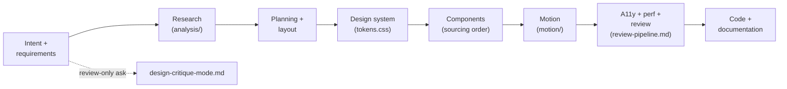

# Architecture

How the pieces of this skill fit together. Keep both diagrams in sync with
reality when adding/removing a file in `references/`, `snippets/`,
`providers/`, `examples/`, or `analysis/` — an inaccurate diagram is worse
than none.

## Skill structure

```mermaid
flowchart TD
    SKILL["SKILL.md<br/>(entry point)"]

    SKILL --> REF["references/"]
    SKILL --> SNIP["snippets/"]
    SKILL --> PROV["providers/"]
    SKILL --> EX["examples/"]
    SKILL --> AN["analysis/"]

    REF --> DS["design-system.md"]
    REF --> MP["motion-principles.md"]
    REF --> QC["quality-checklist.md"]
    REF --> RP["review-pipeline.md<br/>(7 named lenses)"]
    REF --> DCM["design-critique-mode.md<br/>(review-only)"]
    REF --> PRDOC["providers.md"]
    REF --> EXT["extending.md"]

    SNIP --> MOT["motion/<br/>(12 primitives)"]
    SNIP --> HOOKS["MotionProvider,<br/>useMagneticButton,<br/>usePremiumScroll"]
    SNIP --> TOK["tokens.css"]

    PROV --> CRP["ComponentRegistryProvider<br/>(real impl)"]
    PROV --> MLP["MotionLibraryProvider<br/>(real impl)"]
    PROV --> DIP["DesignInspirationProvider<br/>(interface only)"]
    PROV --> TP["TemplateProvider<br/>(interface only)"]
    PROV --> AP["AssetProvider<br/>(interface only)"]

    AN --> PP["project-profile.ts"]

    EX --> LAND["ai-saas-landing/<br/>(reference build)"]
```

## Workflow pipeline

## What's real vs. interface-only

See `providers/README.md` for the authoritative, kept-up-to-date table.
Don't duplicate that table here — link to it instead, so there's one place
to update when a provider gets a real implementation.

## Not yet built

- A plugin system (register/configure/execute/dispose lifecycle for
  third-party extensions) — planned for a future PR. Nothing in this repo
  implements one yet; don't describe one as existing.
- Live adapters for any external service (21st.dev, Spline, Mobbin, ...) —
  same status, see `providers/README.md`.
