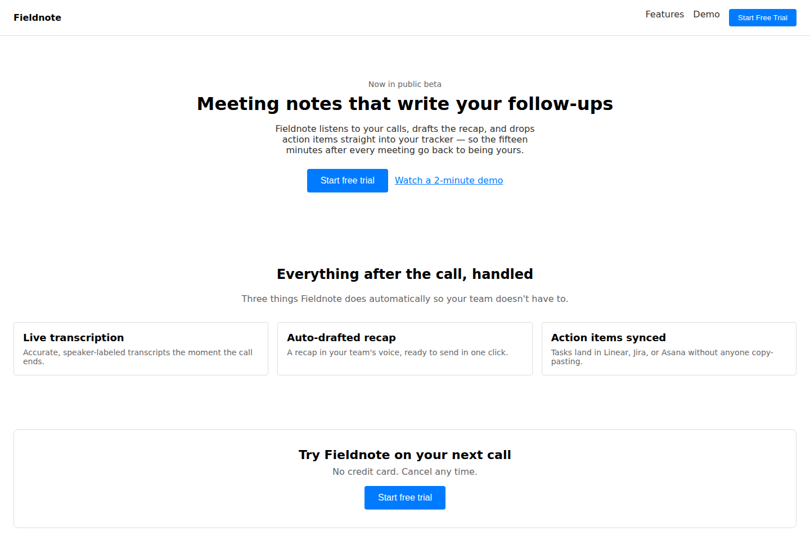
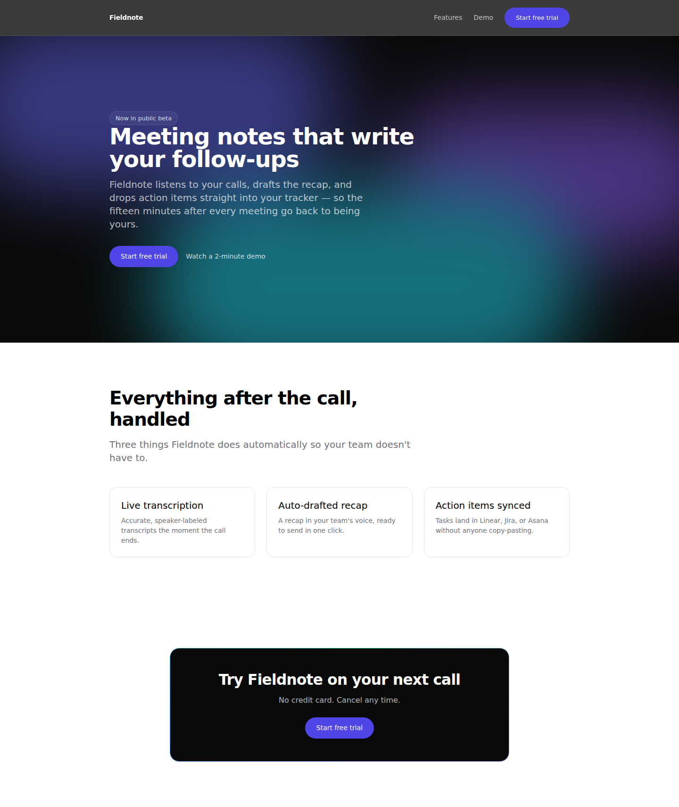
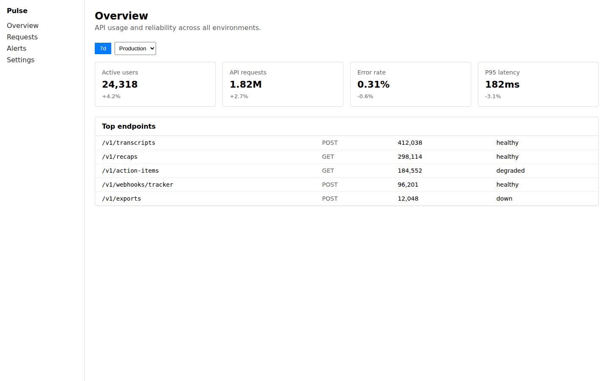
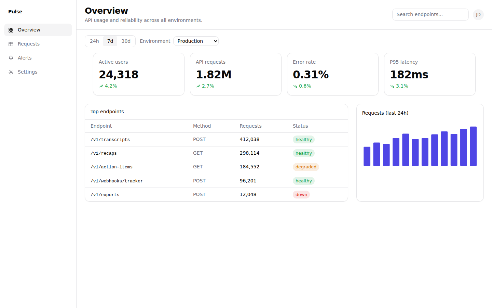
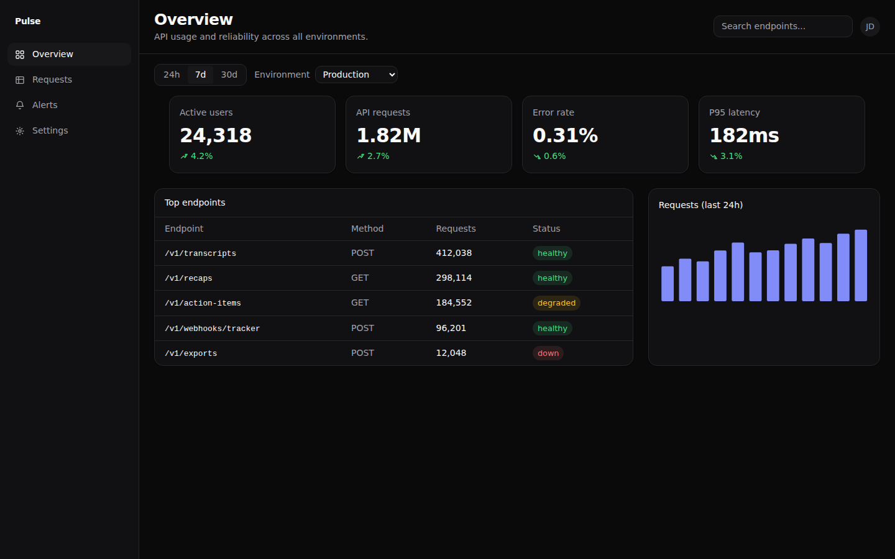

# Showcase index

What exists today, what's planned, and the real evidence for each completed
showcase — before/after screenshots, the prompt used, design rationale, and
links to the actual source. See `README.md` for how this pipeline works and
why it's isolated from the rest of the skill.

## Status

- [x] AI SaaS Landing
- [x] Analytics Dashboard (Pulse)
- [ ] Marketplace
- [ ] CRM
- [ ] Finance
- [ ] Portfolio
- [ ] Healthcare
- [ ] Travel
- [ ] Admin
- [ ] E-commerce

Unchecked items are genuinely not started — no code, no screenshots exist
for them. Per `references/roadmap.md`'s "one showcase per PR, each with
real captured screenshots" rule, they'll move to checked only once actually
built and captured, not when merely planned.

---

## AI SaaS Landing

|                                    |                                                                                                                                                                              |
| ---------------------------------- | ---------------------------------------------------------------------------------------------------------------------------------------------------------------------------- |
| **Prompt**                         | See [`landing-page/prompt.md`](landing-page/prompt.md)                                                                                                                       |
| **Design rationale**               | [`examples/ai-saas-landing/README.md`](../examples/ai-saas-landing/README.md)                                                                                                |
| **Accessibility notes**            | [`landing-page/VISUAL_DIFF.md`](landing-page/VISUAL_DIFF.md)'s Accessibility section                                                                                         |
| **Performance notes**              | `examples/ai-saas-landing/README.md` §7                                                                                                                                      |
| **Reusable components introduced** | `Navbar`, `HeroSection`, `FeatureGrid`, `FeatureCard`, `CtaSection` (see [`snippets/components/README.md`](../snippets/components/README.md))                                |
| **Live preview**                   | Not available — this repo doesn't run or deploy anything; see the root [`README.md`](../../../../README.md)'s Installation section for running the skill in your own project |
| **Source**                         | [`examples/ai-saas-landing/`](../examples/ai-saas-landing/) · [`showcase/landing-page/`](landing-page/)                                                                      |

**Before** (baseline, desktop)

**After** (MotionCanvas, desktop)

Full before/after set (tablet, mobile) in
[`landing-page/screenshots/`](landing-page/screenshots/); full narrative in
[`landing-page/VISUAL_DIFF.md`](landing-page/VISUAL_DIFF.md), including the
three real bugs building this showcase found and fixed.

---

## Analytics Dashboard (Pulse)

|                                    |                                                                                                                                                                                                                                          |
| ---------------------------------- | ---------------------------------------------------------------------------------------------------------------------------------------------------------------------------------------------------------------------------------------- |
| **Prompt**                         | See [`dashboard/prompt.md`](dashboard/prompt.md)                                                                                                                                                                                         |
| **Design rationale**               | [`examples/analytics-dashboard/README.md`](../examples/analytics-dashboard/README.md)                                                                                                                                                    |
| **Accessibility notes**            | [`dashboard/VISUAL_DIFF.md`](dashboard/VISUAL_DIFF.md)'s Accessibility section                                                                                                                                                           |
| **Performance notes**              | `examples/analytics-dashboard/README.md` §7                                                                                                                                                                                              |
| **Reusable components introduced** | `MetricCard`, `DataTable`, `SparklineChart`, `StatusBadge`, `Sidebar`, `Topbar`, `FilterBar`/`SegmentedControl`, `EmptyState`, `ErrorState`, `LoadingSkeleton` (see [`snippets/components/README.md`](../snippets/components/README.md)) |
| **Live preview**                   | Not available — see above                                                                                                                                                                                                                |
| **Source**                         | [`examples/analytics-dashboard/`](../examples/analytics-dashboard/) · [`showcase/dashboard/`](dashboard/)                                                                                                                                |

**Before** (baseline, desktop)

**After** (MotionCanvas, desktop)

**After, dark mode** (desktop)

Full before/after set (tablet, mobile) in
[`dashboard/screenshots/`](dashboard/screenshots/); full narrative in
[`dashboard/VISUAL_DIFF.md`](dashboard/VISUAL_DIFF.md), including the real
Tailwind/token bug building this showcase found and fixed.
